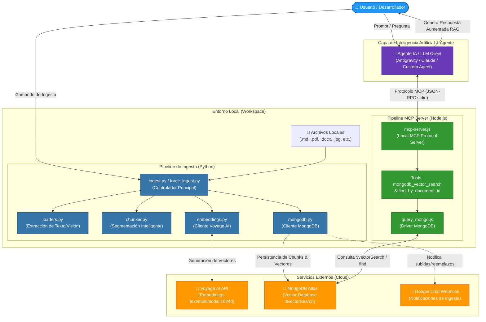
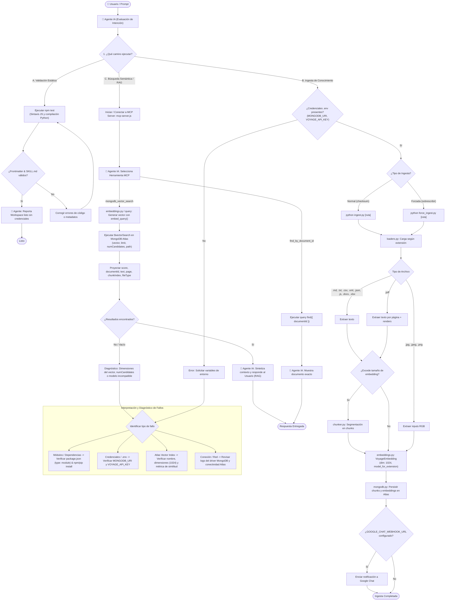
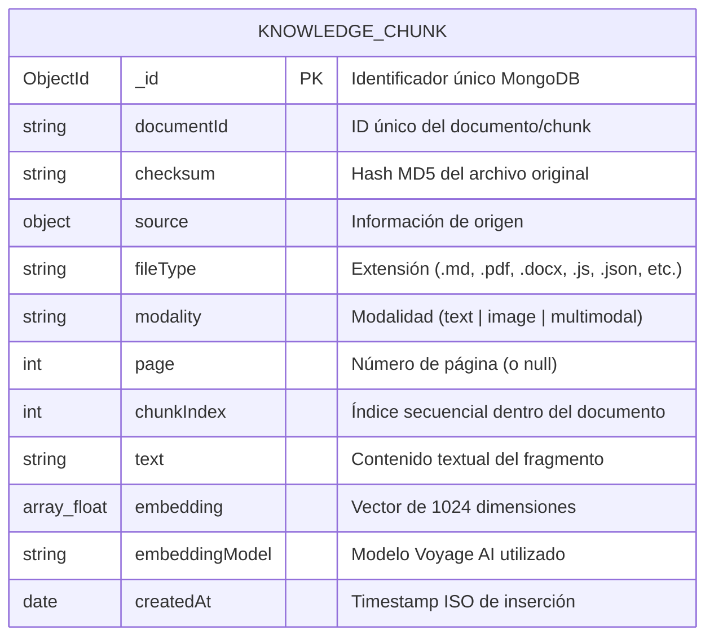

# MongoDB Vector Search Skill

Una skill para preparar conocimiento multimodal, generar embeddings con Voyage AI, almacenarlos en MongoDB Atlas y recuperarlos con búsqueda vectorial mediante un servidor MCP local.

## Propósito

Este proyecto permite:

- Ingestar documentos en formato Markdown, Texto (txt, csv, xml, json, js), Office (docx, xlsx), PDF e imágenes.
- Dividir el contenido en chunks para mejorar la recuperación semántica.
- Generar embeddings con Voyage AI.
- Guardar los documentos y sus vectores en MongoDB Atlas.
- Notificar automáticamente a Google Chat (Webhook) las subidas y los reemplazos de documentos.
- Ejecutar una búsqueda vectorial a través del tool `mongodb_vector_search` expuesto por `mcp-server.js`.

La idea principal es soportar un flujo de Retrieval-Augmented Generation (RAG) o búsqueda semántica sobre documentos locales.

## ¿Cuándo usar esta skill?

Es útil cuando necesitas:

- Construir una búsqueda semántica sobre documentación técnica o conocimiento interno.
- Ingestar fuentes de tipo `.md`, `.txt`, `.csv`, `.xml`, `.json`, `.js`, `.docx`, `.xlsx`, `.pdf`, `.jpg`, `.jpeg` o `.png`.
- Generar embeddings para documentos y consultas con el mismo modelo y dimensiones compatibles.
- Validar una configuración de Atlas Vector Search, embeddings o MCP server.

## Requisitos

Antes de usar la skill debes tener:

- Node.js y npm instalados.
- Python 3 disponible en el entorno activo.
- Una instancia de MongoDB Atlas con soporte a Atlas Vector Search.
- Una API key válida de Voyage AI.
- Un archivo `.env` con las variables necesarias.

## Instalación

1. Instala dependencias de Node:

```bash
npm install
```

2. Instala dependencias de Python requeridas por la ingesta y los embeddings:

```bash
python3 -m pip install pymupdf pillow voyageai python-dotenv python-docx openpyxl
```

3. Crea un archivo `.env` en la raíz del proyecto con variables como estas:

```env
MONGODB_URI="mongodb+srv://<usuario>:<password>@<cluster>/test?retryWrites=true&w=majority"
MONGODB_DB="knowledgeVectors"
MONGODB_COLLECTION="knowledge"
VECTOR_INDEX_NAME="vector_index"
VOYAGE_API_KEY="<tu_api_key>"
DOCUMENTS_PATH="/ruta/a/documentos"
GOOGLE_CHAT_WEBHOOK_URL="https://chat.googleapis.com/..."
```

> El archivo `.env` no debe subirse al repositorio si incluye secretos reales.

## Variables de entorno relevantes

Estas son las variables que usa el proyecto:

- `MONGODB_URI`: cadena de conexión a MongoDB Atlas.
- `MONGODB_DB`: base de datos de destino. Por defecto: `knowledgeVectors`.
- `MONGODB_COLLECTION`: colección donde se almacenan los chunks. Por defecto: `knowledge`.
- `VECTOR_INDEX_NAME`: nombre del índice vectorial en Atlas. Por defecto: `vector_index`.
- `VOYAGE_API_KEY`: clave para el servicio de embeddings de Voyage AI.
- `DOCUMENTS_PATH`: ruta por defecto para el directorio con documentos a ingerir.
- `CHUNK_SIZE`: longitud aproximada de cada chunk de texto.
- `CHUNK_OVERLAP_SENTENCES`: superposición entre chunks.
- `GOOGLE_CHAT_WEBHOOK_URL`: (Opcional) URL del webhook de Google Chat para enviar notificaciones de subidas y actualizaciones de documentos.
- `EMBED_BATCH_SIZE`: tamaño del lote para embeding en batch.

## Flujo de trabajo y Arquitectura (Architecture & Workflow)

La arquitectura de esta skill se divide en dos fases principales: **Ingesta de Datos** (Python) y **Búsqueda Vectorial/MCP** (Node.js). Ambos procesos interactúan con servicios de Inteligencia Artificial (Voyage AI) y persistencia en la nube (MongoDB Atlas).

### Diagrama de Arquitectura de la Skill



### Diagrama de Flujo de Todos los Caminos Posibles (Decision Flowchart)

El siguiente diagrama detalla todas las rutas de ejecución posibles coordinadas por el **Agente IA / Usuario**, incluyendo validación estática, ingesta multimodal, búsqueda semántica vía MCP y resolución de fallos:



El flujo principal paso a paso es el siguiente:

### 1. Preparar los documentos

El proyecto acepta documentos con estas extensiones:

- `.md`, `.txt`, `.csv`, `.xml`, `.json`, `.js`
- `.docx`, `.xlsx`
- `.pdf`
- `.jpg`
- `.jpeg`
- `.png`

Los archivos se leen con `loaders.py`:

- Markdown: procesa el texto, decodifica imágenes incrustadas en Base64 (`data:image/...`) y carga imágenes referenciadas localmente (`` o ``).
- Texto (.txt, .csv, .xml, .json, .js) / Excel (.xlsx): se procesa como texto estructurado.
- DOCX: extrae los párrafos de texto y todas las imágenes embebidas en el documento.
- PDF: cada página se convierte a bloque multimodal (texto extraído + imagen renderizada).
- Imagen: se convierte a RGB y se usa como entrada multimodal con Voyage AI.

### 2. Dividir contenido en chunks

`chunker.py` segmenta el texto para crear bloques manejables. El proceso genera chunks con metadata como:

- `documentId`
- `checksum`
- `source.path`
- `fileType`
- `modality`
- `page`
- `chunkIndex`
- `text`
- `embedding`
- `embeddingModel`

La lógica de `ingest.py` evita volver a insertar archivos sin cambios usando un checksum MD5.

### 3. Generar embeddings

`embeddings.py` encapsula la API de Voyage AI.

El proyecto usa modelos configurados por extensión, y todos los documentos que compartan un mismo índice vectorial deben usar un modelo compatible con el mismo índice.

Modelos por defecto:

- Texto: `voyage-4-large`
- Multimodal: `voyage-multimodal-3.5`
- Dimensión del embedding: `1024`

### 4. Persistir en MongoDB Atlas

`mongodb.py` gestiona:

- conexión a MongoDB
- inserción masiva de documentos embebidos
- comprobación de checksums
- eliminación de documentos previos por `documentId`

### 5. Ejecutar búsqueda vectorial

El servidor MCP se inicia con:

```bash
node mcp-server.js
```

Las herramientas disponibles son:

- **`mongodb_vector_search`**: Búsqueda semántica usando `$vectorSearch`.
  Parámetros:
  - `vector`: arreglo de números que representa el embedding de la consulta.
  - `limit`: número máximo de resultados, por defecto `5`.
  - `numCandidates`: cantidad de candidatos a evaluar, por defecto `50`.
  - `path`: campo vectorial dentro del documento, por defecto `embedding`.
  
  El pipeline usa `$vectorSearch` de MongoDB Atlas y luego proyecta:
  - `documentId`
  - `text`
  - `page`
  - `chunkIndex`
  - `fileType`
  - `score` usando `$meta: "vectorSearchScore"`

- **`find_by_document_id`**: Búsqueda exacta por ID de documento.
  Parámetros:
  - `documentId`: (Requerido) string que representa el ID del documento a buscar.
  
  Retorna los fragmentos o el documento que coincida con ese `documentId` usando un `find()` estándar de MongoDB.

## Ingesta de documentos

La forma más directa de procesar una carpeta nueva es:

```bash
python3 ingest.py /ruta/a/documentos
```
*(Si no pasas una ruta, el script usa `DOCUMENTS_PATH` o la ruta por defecto).*

Si deseas **forzar la actualización o re-ingesta** de una carpeta completa o un archivo que ya fue procesado (y quieres borrar la versión anterior para evitar duplicados), utiliza:

```bash
python3 force_ingest.py /ruta/a/documentos
```

Ejemplo:

```bash
python3 ingest.py /Users/JACOLINV/Documents/docsEmb
```

## Ejemplo de uso de embeddings

Puedes generar un embedding para una consulta con Python:

```python
from embeddings import VoyageEmbedding

voyage = VoyageEmbedding(api_key="<tu_api_key>")
query_vector = voyage.embed_query("¿Cómo funciona Atlas Vector Search?")
print(len(query_vector))
```

## Requerimientos y Definición del Índice Vectorial en Atlas

Antes de usar la búsqueda real, debes crear un índice de tipo **Atlas Vector Search** en MongoDB Atlas sobre la colección configurada (`knowledge`).

### Definición JSON del Índice Vectorial (Atlas Vector Search Index)

Crea un índice de búsqueda vectorial en MongoDB Atlas con la siguiente definición:

```json
{
  "fields": [
    {
      "type": "vector",
      "path": "embedding",
      "numDimensions": 1024,
      "similarity": "cosine"
    }
  ]
}
```

> [!IMPORTANT]
> - **Nombre del índice**: Debe coincidir con `VECTOR_INDEX_NAME` (por defecto: `vector_index`).
> - **Campo (`path`)**: `embedding`.
> - **Dimensiones (`numDimensions`)**: `1024` (producido por `voyage-4-large` y `voyage-multimodal-3.5`).
> - **Métrica (`similarity`)**: `cosine` o `dotProduct`.

---

## Esquema del Documento en MongoDB (Schema & Metadata Spec)

Cada fragmento o imagen procesada se persiste como un documento BSON con la siguiente estructura:



### Ejemplo de Documento en MongoDB:

```json
{
  "_id": { "$oid": "664b3a123f89a9c1e0123456" },
  "documentId": "manual_usuario_chunk_0",
  "checksum": "d41d8cd98f00b204e9800998ecf8427e",
  "source": {
    "path": "/ruta/a/documentos/manual_usuario.docx",
    "name": "manual_usuario.docx"
  },
  "fileType": ".docx",
  "modality": "text",
  "page": null,
  "chunkIndex": 0,
  "text": "Introducción y configuración del sistema...",
  "embedding": [0.01234, -0.05678, 0.08912, "... (1024 floats)"],
  "embeddingModel": "voyage-multimodal-3.5",
  "createdAt": "2026-09-30T20:30:00.000Z"
}
```

---

## Configuración del Cliente MCP (Agent Client Integration)

Para conectar este servidor MCP con clientes de IA (Claude Code, Claude Desktop, Antigravity, Cline, Gemini Code Assist, etc.), agrega la siguiente configuración en tu archivo de herramientas MCP (`claude_desktop_config.json`, `mcp_settings.json` o settings de tu entorno):

```json
{
  "mcpServers": {
    "mongodb-vector-skill": {
      "command": "node",
      "args": [
        "/ruta/absoluta/a/mongodb-vector-skill/mcp-server.js"
      ],
      "env": {
        "MONGODB_URI": "mongodb+srv://<usuario>:<password>@<cluster>/test?retryWrites=true&w=majority",
        "MONGODB_DB": "knowledgeVectors",
        "MONGODB_COLLECTION": "knowledge",
        "VECTOR_INDEX_NAME": "vector_index"
      }
    }
  }
}
```

## Estructura de archivos

```text
.
├── chunker.py
├── embeddings.py
├── force_ingest.py
├── ingest.py
├── loaders.py
├── mcp-server.js
├── mongodb.py
├── package.json
├── README.md
├── SKILL.md
└── SKILL_old.md
```

### Descripción por archivo

- `ingest.py`: procesa documentos y genera embeddings para insertarlos en MongoDB.
- `force_ingest.py`: herramienta que fuerza la re-ingesta de archivos, borrando versiones o duplicados previos por nombre.
- `loaders.py`: cargadores para Markdown, PDF e imágenes.
- `embeddings.py`: wrapper para Voyage AI y generación de embeddings.
- `chunker.py`: división del texto en chunks inteligentes.
- `mongodb.py`: operaciones de persistencia y validación en MongoDB.
- `mcp-server.js`: servidor MCP que expone la herramienta de búsqueda vectorial.
- `SKILL.md`: definición de la skill para uso del entorno de agentes.

## Validación

Para validar el proyecto de forma estática, ejecuta:

```bash
npm test
```

Este comando comprueba:

- sintaxis JavaScript de `mcp-server.js`
- compilación de archivos Python con `compileall`

## Solución de problemas

### Error de conexión a MongoDB

- Revisa que `MONGODB_URI` sea válida.
- Verifica que el cluster esté disponible y que expongas la base de datos correcta.
- Comprueba el nombre del índice vectorial.

### Error por falta de variables de entorno

- Asegúrate de cargar `.env` antes de ejecutar la ingesta.
- Verifica que `VOYAGE_API_KEY` y `MONGODB_URI` existan.

### Resultados vacíos o pobres

- Confirma que el modelo usado para documentos y consultas sea compatible.
- Revisa que la dimensión del vector coincida con la del índice.
- Mejora la calidad de los chunks o reduce la cantidad de contenido por bloque.

### Errores de modelo multimodal

- Algunas extensiones como PDF, JPG, JPEG y PNG requieren un modelo multimodal.
- Si usas un modelo no compatible, la ingesta puede fallar en `build_chunks()`.

## Resumen

Esta skill combina:

- carga de documentos,
- generación de embeddings,
- almacenamiento vectorial en MongoDB Atlas,
- recuperación semántica con `mongodb_vector_search`.

Es una base útil para construir un RAG local o un sistema de búsqueda por similitud sobre documentación y conocimiento digital.

## Referencias internas

- `SKILL.md`: especificación de la skill.
- `mcp-server.js`: herramienta de acceso a la búsqueda vectorial.
- `ingest.py`: flujo principal de ingesta y embeddings.

## Siguiente paso recomendado

1. Configura `.env` con tus credenciales reales.
2. Define el índice vectorial en Atlas.
3. Añade una carpeta de documentos de prueba.
4. Ejecuta `python3 ingest.py`.
5. Inicia el MCP server y prueba `mongodb_vector_search` con un embedding de consulta real.
